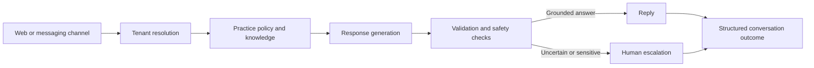

# AI receptionist — engineering case study

**A public-safe overview of building a configurable conversational assistant for multi-practice, after-hours enquiries.**

> This repository documents architecture and engineering decisions only. Production code, customer data, provider credentials, private prompts and practice-specific knowledge remain private.

## Problem

A useful receptionist must answer common questions quickly while respecting the boundaries of each practice. The system therefore needs more than a chat UI: it needs tenant isolation, grounded answers, escalation paths, observability and safe failure behaviour.

## System shape

incoming message → tenant resolution → policy and knowledge retrieval → response generation → validation → answer or escalation

## Key engineering decisions

| Challenge | Approach | Benefit |
|---|---|---|
| Multiple practices share one product | Resolve tenant context before retrieval or generation | Knowledge and policy boundaries are explicit |
| Models can sound confident when uncertain | Validate grounding and route low-confidence cases to escalation | The assistant fails safely instead of inventing policy |
| Repeated questions need consistency | Keep practice knowledge separate from shared behaviour rules | Updates are auditable and reusable |
| After-hours conversations need follow-through | Capture structured outcomes and handoff details | Staff can act without rereading every transcript |
| A web embed must be easy to deploy | Keep the client thin and put policy at the service boundary | Integrations remain replaceable and testable |

## What I built

- Configurable conversational behaviour shared across practices
- Per-practice knowledge and policy boundaries
- Web-embeddable interface for low-friction deployment
- Request validation, escalation and failure handling
- Structured outcome capture for operational review

## Safety and privacy boundary

- No customer records, transcripts or private knowledge bases are published here
- Credentials and model-provider keys stay behind an authenticated service boundary
- Sensitive or uncertain requests are designed to escalate rather than receive a guessed answer
- Tenant context is treated as an authorization boundary, not merely a prompt variable

## What this demonstrates

This project represents applied AI product engineering: taking a probabilistic language interface and surrounding it with configuration, validation, retrieval boundaries, operational workflows and human control.

Designed and engineered by [Abdullah Nadeem](https://github.com/Abz119). Connect on [LinkedIn](https://www.linkedin.com/in/abdullahnadeem17).
